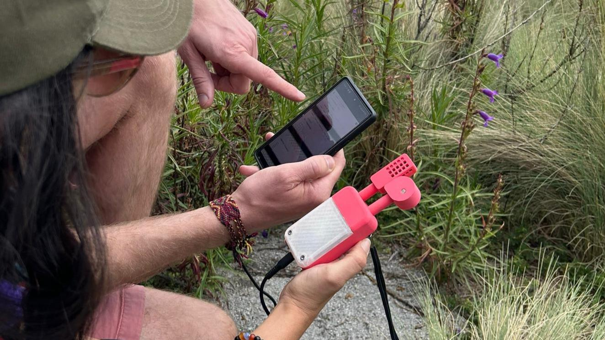

# FiledKit SensorBox
- WIP!
- This project was created as a part of the team effort of the **Modular Environmental MicroMuseum (Mobio)** group from the LABNL Lab and the InnovactionGYM in Monterrey, Mexico for the Fab Mexico Challenge 2024
- The sensors work together with the BLE UI you can found here: https://github.com/kyjanond/labnl-fieldkit
- It was created fast, dirty and it probably contains lots of bugs. No guarantees.

### Flashing
- Use PlatformIO to flash the project.

### Printing
- you can find the .stl files in the `model` folder. 